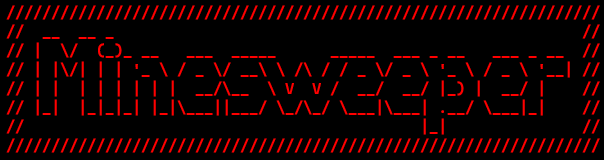
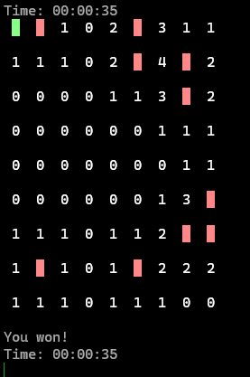
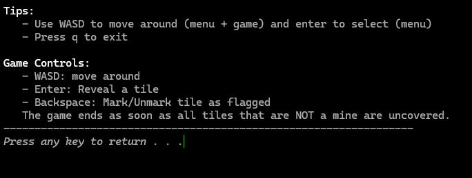

<div align="center">


Minesweeper is a CLI implementation of the classical Minesweeper game.

[](https://hackatime-badge.hackclub.com/U087BUC6ZFW/Minesweeper) 
[](https://opensource.org/licenses/MIT)
[](https://github.com/JameDevOfficial/Minesweeper/releases/latest)
[](https://github.com/JameDevOfficial/Minesweeper/commits/main)

</div>

# Features
- Play a round of minesweeper
- Choose between easy, medium and hard
- Beat your personal highscores (they save in files!)
- Auto reveal when clicking on a tile with enough flags set
- Reveal connected 0 fields when clicking on one

Entirely written in C with custom print library (for printing with colors and styles)

# Screenshots
### The Menu
 

### The Game (Easy)


### Game won (Easy)
 

### Help Menu
 

# Run
## Windows
Build the game using mingw32 and run the .exe file

```sh
    >cd src
    >gcc.exe main.c -o minesweeper.exe
    >./minesweeper.exe
``` 

## Linux
Build the game using a c compiler (downloaded trough a package manager)

```sh
    >cd src
    >gcc main.c -o minesweeper.out
    >./minesweeper.out
``` 

# Bugs
- last frame not rendering after game is won/lost

# License
This project is published under the [MIT LICENSE](LICENSE)

# Other
This project was made for hackclub siege week 10 (main week 6)